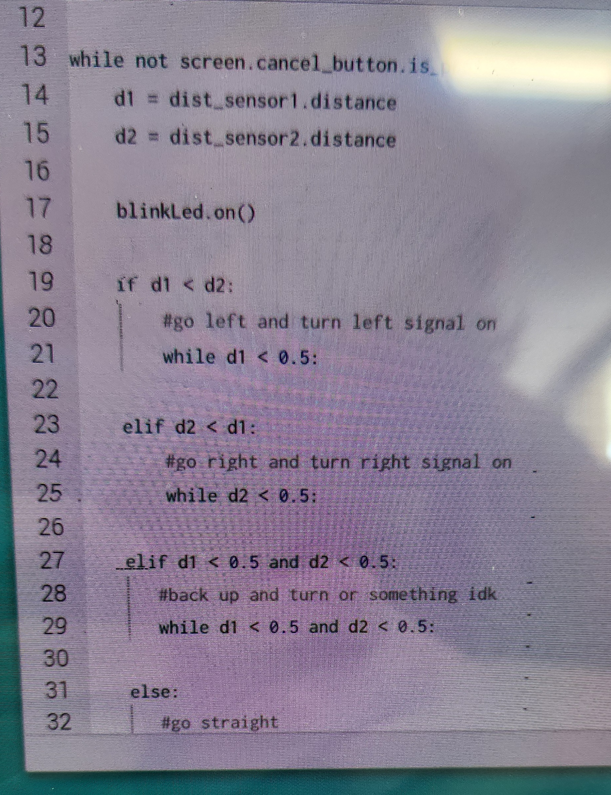
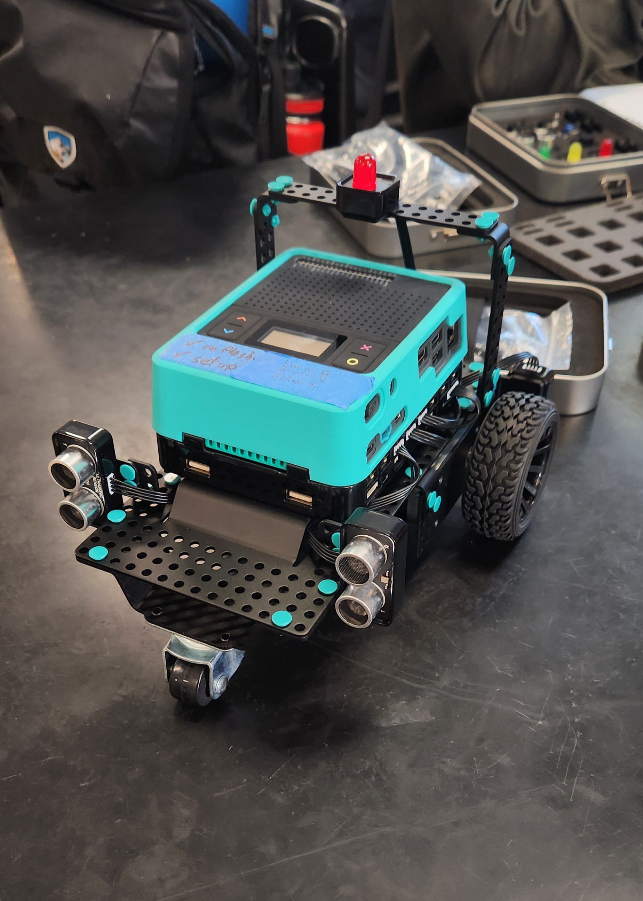

# DE Final Project: Roomba
# Where did this idea come from?
My main inspiration, as you might be able to tell from what I ended up calling this project, was the roomba. I was extremely inspired to make a robot that functioned by roaming around aimlessly while also avoiding any obstacles in its path. Although I didn't really care about its abilities to clean. Instead of navigating by bumping into objects, like a real roomba does, I decided that it was best to use the distance sensors provided in the pi-top kits.

# Prototyping & Design Process
Using the parts that were avaliabel to me in the pi-top kits, I began to build my robot, unfortunately I do not have any images during this process, although nothing incredibly interesting happened. The only major design revisions that I created was to add turn signals to the back of the robot. The idea behind these was so that each one could blink depending on how the robot turned. Another red light was put on top in the hopes that it would make the robot a little more visable to those walking around in, it is quite small at the end of the day. The most important part of the design is the location of the distance sensors, because I wanted the robot to be able to avoid objects with some level of intelligence instead of randomly turning because it detected _something_, I decided that two distance sensors would be required. To maximise the lateral "view range" of the robot I put one sensor on either side facing forward. The overall concept of the code was that the two values from the distance sensors would be compared and a decision would be made based on those values.

Below is an early example of my code.

After testing the code I ended up having to make several revisions, including adding a way for the robot to back up since I found there were instances where it can get stuck. On top of this I found that the speed of the robot would change how reliable its object avoidence is, with the faster it goes, the worse it manages to move out of the way of objects, so I ended up setting the motor's rpm to 50. Overall, this process went much smoother than I expected it to.

# Final Design

In the end, the robot works just as I wanted it to, with the only problems that it deals with is navigating corners. Like I have stated above, the way the robot functions is by comparing the values that are inputed by the distance sensor. For example, if we look at the robot from above as it aproaches an object, the right distance sensor might give a value of 20cm while the left might give a value of 30cm. Because the value of the right sensor is less than that of the left, the robot will turn to the left, moving away from the closer object. It will continue the turn until the distances from the sensors is greater than a certain value.

Below is a picture of the final design.

